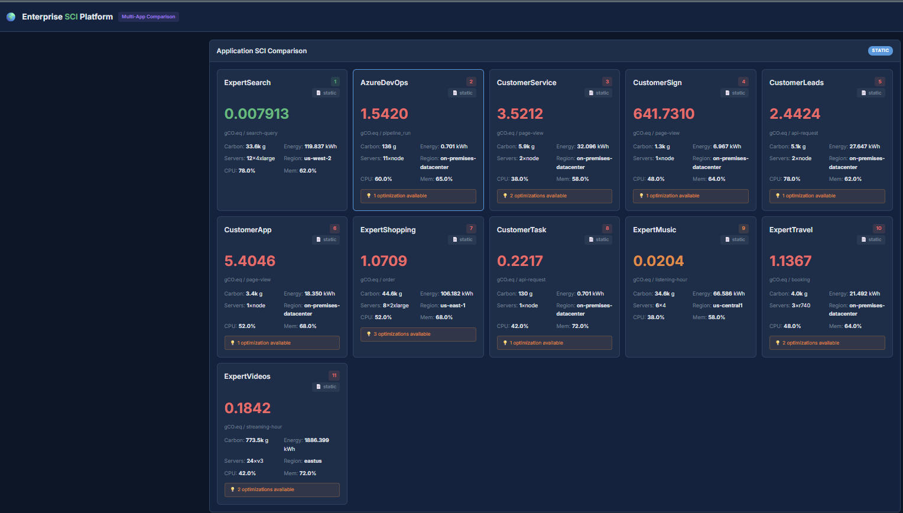
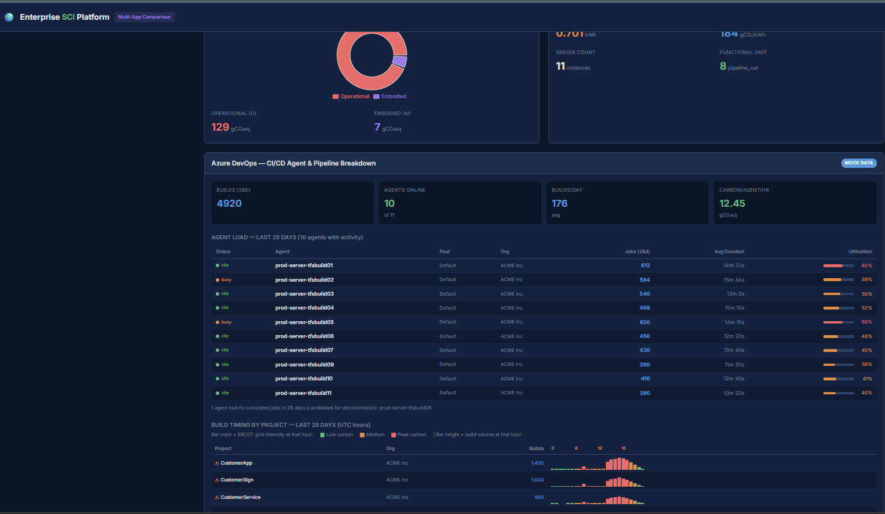
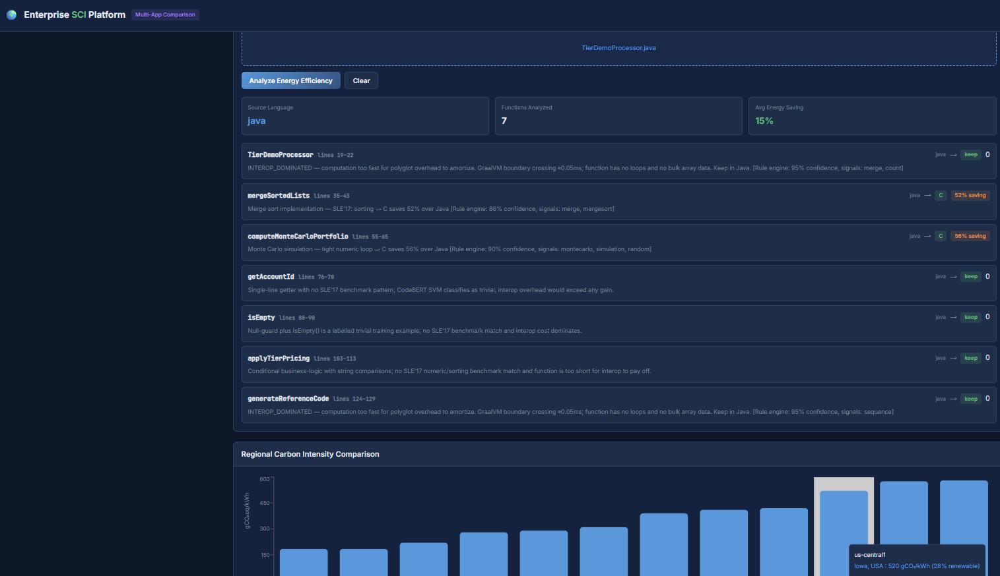
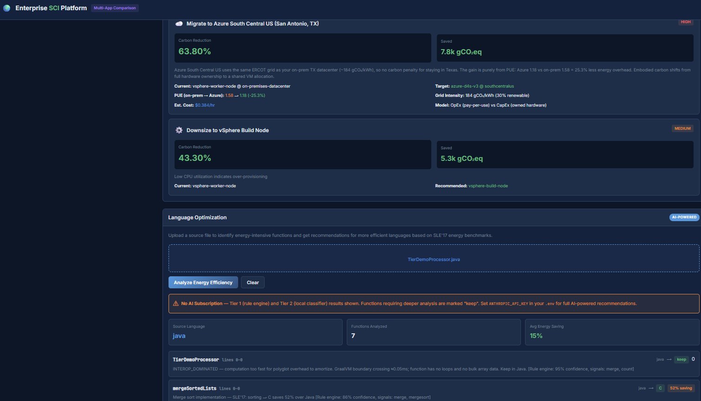

# Enterprise Multi-Application SCI Platform

A comprehensive carbon intensity comparison platform for enterprise applications. Compare SCI scores across 6 applications, get infrastructure optimization recommendations, and automatically identify energy-intensive code functions for GraalVM polyglot rewriting — all backed by the SLE'17 energy paper and the Green Software Foundation Impact Framework.

---

## Screenshots

### SCI Dashboard — Multi-Application Carbon Comparison


### Azure DevOps — Agent Utilization & Build-Hour Heatmap


### Language Optimizer — Three-Tier Analysis Results


### Language Optimizer — No AI Subscription Degradation


---

## Features

### SCI Dashboard
- Real hardware configurations (AWS m5.2xlarge, c5.4xlarge, Azure D4s v3, GCP n2-standard-4, Dell R740)
- Actual embodied carbon data from Boavizta API and Cloud Carbon Footprint
- Hourly usage metrics with realistic workload patterns
- Full Impact Framework SCI pipeline (16 stages)

### Infrastructure Optimization Engine
Three types of recommendations:
1. **Region Relocation** — Move to lower-carbon regions (live grid data)
2. **Server Right-Sizing** — Downsize over-provisioned instances
3. **Time-Shifting** — Schedule batch jobs during low-carbon hours

### Live Carbon Intensity
- Electricity Maps and WattTime v3 API integration for real-time grid data
- Multi-region comparison (US, EU, APAC)
- Fallback to IEA 2022 static intensities

### Language Optimizer (AI-Powered)
Upload any source file and the three-tier pipeline identifies which functions should be rewritten in a more energy-efficient language and generates the replacement code, ready for GraalVM polyglot embedding. See the [Three-Tier Analysis Pipeline](#three-tier-analysis-pipeline) section for how it works.

---

## Quick Start

### Prerequisites
- Docker ≥ 20.10
- Docker Compose v2

### 1. Clone and configure
```bash
cp .env.example .env
# Add your API keys — all optional, platform runs on static data without them
```

### 2. Launch
```bash
docker compose up --build
```

| Service | URL | Description |
|---------|-----|-------------|
| SCI Dashboard | http://localhost:3000 | Multi-app carbon comparison |
| Backend API | http://localhost:5000 | SCI calculation engine |
| Language Optimizer | http://localhost:8000 | Code energy analysis |

### 3. Explore
- View all 6 applications ranked by SCI score
- Click any app for carbon breakdown and optimization recommendations
- Drop a Java/Python/JS/Ruby file into the Language Optimization card to get energy-efficiency recommendations

---

## Three-Tier Analysis Pipeline

The Language Optimizer uses a tiered system that avoids calling an AI API for every function. Each tier only passes functions upward when it cannot confidently classify them.

```
Source file
    │
    ▼
┌─────────────────────────────────────────────────────┐
│  TIER 1 — Rule Engine             (instant, no API) │
│  Keyword signal matching vs SLE'17 benchmark cats   │
│  Confidence ≥ 0.85 → direct recommendation         │
└───────────────────┬─────────────────────────────────┘
                    │ unmatched / low confidence
                    ▼
┌─────────────────────────────────────────────────────┐
│  TIER 2 — CodeBERT + SVM          (fast, no API)   │
│  768-dim CLS embeddings, SVM trained on 127 examples│
│  Confidence ≥ 0.75 → recommendation                │
└───────────────────┬─────────────────────────────────┘
                    │ still unclassified
                    ▼
┌─────────────────────────────────────────────────────┐
│  TIER 3 — AI Provider          (Claude/OpenAI/Ollama)│
│  Full code generation + rewrite in target language  │
│  Pluggable via AIProvider interface                 │
└─────────────────────────────────────────────────────┘
```

### Tier 1 — Rule Engine

Detects known SLE'17 benchmark patterns from function names, parameter types, and body keywords. Runs in milliseconds with no external calls.

**How confidence is scored:**

Each pattern has a set of keyword signals. When analyzing a function, the engine counts how many signals match and computes:

```
confidence = min(pattern.base_confidence, 0.70 + num_signals_matched × 0.08)
threshold  = 0.85
```

A function reaches Tier 1 recommendation only if its confidence ≥ 0.85.

**Built-in SLE'17 patterns:**

| Pattern | Key signals | Target | Why |
|---------|------------|--------|-----|
| `sorting` | sort, merge, quicksort, compareTo | C | Best raw numeric throughput |
| `monte_carlo` | montecarlo, simulation, random, gaussian | C | Tight FP loop, SIMD-friendly |
| `hash_map_counting` | HashMap, kmer, nucleotide, frequency | Rust | Safe hash maps (K-Nucleotide) |
| `fasta` | BlockingQueue, AtomicInteger, DNA, nucleotide | Rust | Memory-safe concurrency |
| `binary_trees` | TreeNode, leftChild, rightChild, recursive | Rust | Ownership model eliminates GC |
| `deep_recursion` | ackermann, fibonacci, recursive depth | C++ | Stack discipline |
| `orchestration` | process, pipeline, workflow, System.out | keep | Coordination cost exceeds savings |
| `trivial` | getter, setter, toString, < 5 lines | keep | Interop overhead dominates |

### Tier 2 — Local CodeBERT Classifier

A scikit-learn SVM trained on 127 hand-labeled examples of the SLE'17 benchmark categories. At runtime, it extracts a 768-dimensional CLS embedding from the function source using CodeBERT, then classifies it.

- Training: `python scripts/train_classifier.py` (one-time, ~2 min on CPU)
- Model: `models/codebert/sle17_classifier.pkl`
- Threshold: confidence ≥ 0.65 to attempt classification, ≥ 0.75 to commit to a recommendation
- Disable: set `ENABLE_TIER2=false` in `.env` for faster cold starts (functions skip straight to Tier 3)

### Tier 3 — AI Provider

Handles functions that Tiers 1 and 2 could not confidently classify. The AI sees the full function source plus the Tier 1/2 pre-analysis hints, so it only needs to reason about genuinely ambiguous cases. It also generates all rewritten code in the target language.

The AI backend is swappable via the `AIProvider` interface — see [Pluggable AI Provider](#pluggable-ai-provider).

**Graceful degradation:** if no AI credentials are configured, Tier 1 and Tier 2 results are still returned. Functions that needed Tier 3 are marked `keep` with a `No AI subscription` note rather than failing.

---

## Energy Savings Calculation

All energy efficiency recommendations derive from the SLE'17 paper:

> Pereira et al. (2017). *Energy Efficiency Across Programming Languages: How Do Energy, Time, and Memory Relate?* SLE'17, Vancouver, Canada.

The paper measured energy consumption of 10 benchmark problems implemented in 27 languages. Normalized to C = 1.00:

| Language | Energy factor | vs Java | vs Python |
|----------|:---:|:---:|:---:|
| C | 1.00× | −50% | −99% |
| Rust | 1.03× | −48% | −99% |
| C++ | 1.34× | −32% | −98% |
| Java | 1.98× | baseline | −97% |
| JavaScript | 4.45× | +125% | — |
| Python | 75.88× | +3,733% | baseline |

**Savings formula:**

```
energy_savings_percent = (1 - E_target / E_source) × 100
```

Examples for a Java source file:
- `Java → C`:    `(1 - 1.00 / 1.98) × 100 = 49.5%`
- `Java → Rust`: `(1 - 1.03 / 1.98) × 100 = 48.0%`
- `Java → C++`:  `(1 - 1.34 / 1.98) × 100 = 32.3%`

**When the optimizer recommends `keep`:** The GraalVM polyglot boundary crossing has a fixed overhead (~0.05 ms). For very fast functions (trivial getters, simple boolean checks, string formatting) the interop cost exceeds the compute savings, so keeping them in the original language is the correct call even if a faster language exists.

### GraalVM Polyglot Embedding

The optimizer generates code that runs natively inside the JVM via GraalVM Sulong:

```
Java orchestrator
    │
    ├── polyglot.eval("llvm", bitcode)  ← C/C++/Rust compiled to LLVM bitcode
    │       └── native function (zero-copy FFI)
    └── polyglot.eval("js", jsSource)   ← JavaScript via GraalJS
```

Only functions above the interop-overhead threshold are extracted. The orchestrator (main method / entry point) always stays in Java.

---

## Pluggable AI Provider

The Tier 3 backend implements an `AIProvider` ABC so teams can use any model:

```python
class AIProvider(ABC):
    @property
    def available(self) -> bool: ...   # True if credentials present
    def complete(self, prompt: str, max_tokens: int) -> str: ...
```

**Built-in providers:**

| Provider | `AI_PROVIDER=` | Key env var |
|----------|---------------|-------------|
| Anthropic Claude (default) | `anthropic` | `ANTHROPIC_API_KEY` |
| OpenAI GPT-4o | `openai` | `OPENAI_API_KEY`, `OPENAI_MODEL` |
| Ollama (local, no key) | `ollama` | `OLLAMA_URL`, `OLLAMA_MODEL` |

**To add a custom provider** (Gemini, Bedrock, Azure OpenAI, etc.):
1. Subclass `AIProvider` in `services/language-optimizer/analyzer/ai_provider.py`
2. Implement `name`, `available`, and `complete`
3. Add an `elif` branch in `_get_provider()` in `api/server.py`

---

## Application Portfolio

| Application | Server Config | Region | Workload Pattern | Functional Unit |
|-------------|---------------|--------|------------------|-----------------|
| **AzureDevOps** | 11× vSphere build node | on-premises-datacenter | Burst (CI/CD) | pipeline_run |
| **CustomerApp** | 1× vSphere worker node | on-premises-datacenter | Steady-state | page_view |
| **CustomerLeads** | 1× vSphere worker node | on-premises-datacenter | Steady-state | api_request |
| **CustomerService** | 1× vSphere worker node | on-premises-datacenter | Steady-state | page_view |
| **CustomerSign** | 1× vSphere worker node | on-premises-datacenter | Steady-state | page_view |
| **CustomerTask** | 1× vSphere worker node | on-premises-datacenter | Steady-state | api_request |

---

## Credential Files

The platform runs fully on static fallback data — **no credentials are required to start**. Each integration degrades gracefully:

| Missing credential | Fallback behaviour |
|---|---|
| `ELECTRICITY_MAPS_TOKEN` / `WATTTIME_*` | Grid intensity uses static IEA 2022 values |
| `ga4-service-account.json` / `GA4_PROPERTY_ID` | Functional units use static hourly estimates |
| `ADO_PAT` / `ADO_ORGS` | Build counts use static estimates |
| `ucp-bundle` / `KUBECONFIG_DIR` | Prometheus metrics disabled; static config values used |
| `ANTHROPIC_API_KEY` / AI provider key | Tier 1 + Tier 2 results returned; Tier 3 functions marked "No AI subscription" |
| `ENABLE_TIER2=false` | Tier 2 skipped; Tier 1 + Tier 3 only (faster cold start) |

The only hard requirement is that **`.env` exists** (even if blank). Running `cp .env.example .env` is sufficient.

### Key environment variables (`.env`)

| Variable | Purpose |
|---|---|
| `ELECTRICITY_MAPS_TOKEN` | Live grid carbon intensity |
| `WATTTIME_USER` / `WATTTIME_PASS` | Live MOER data (alternative to Electricity Maps) |
| `AI_PROVIDER` | `anthropic` \| `openai` \| `ollama` (default: `anthropic`) |
| `ANTHROPIC_API_KEY` | Tier 3 AI analysis via Claude |
| `OPENAI_API_KEY` / `OPENAI_MODEL` | Tier 3 via OpenAI (set `AI_PROVIDER=openai`) |
| `OLLAMA_URL` / `OLLAMA_MODEL` | Tier 3 via local Ollama (set `AI_PROVIDER=ollama`) |
| `ENABLE_TIER2` | `true` (default) \| `false` to skip CodeBERT training |
| `GA4_PROPERTY_ID` | Live functional unit counts via GA4 |
| `ADO_PAT` / `ADO_ORGS` | Live Azure DevOps pipeline counts |
| `KUBECONFIG_DIR` | Path to MKE/Prometheus client bundle |

---

## API Endpoints

### SCI Backend (port 5000)

| Method | Path | Description |
|--------|------|-------------|
| GET | `/api/health` | Health check |
| GET | `/api/apps` | List all applications |
| GET | `/api/servers` | List server configurations |
| GET | `/api/regions` | List regions with carbon intensity |
| GET | `/api/compare` | Full comparison (apps + recommendations + regions) |
| POST | `/api/language-optimize` | Proxy to Language Optimizer |

### Language Optimizer (port 8000)

| Method | Path | Description |
|--------|------|-------------|
| GET | `/health` | Health check + classifier status |
| GET | `/config.json` | Active AI provider + availability |
| POST | `/api/analyze` | Analyze source file (three-tier pipeline) |
| POST | `/api/generate` | Analyze + generate polyglot package zip |
| POST | `/api/benchmark` | Analyze + build + run benchmark (Docker) |

**`POST /api/analyze` response shape:**
```json
{
  "source_language": "java",
  "no_api_key": false,
  "functions": [
    {
      "name": "mergeSortedLists",
      "start_line": 35,
      "end_line": 44,
      "category": "sorting",
      "recommended_language": "C",
      "energy_savings_percent": 52,
      "reason": "Merge sort — SLE'17: sorting → C saves 52% over Java [Rule engine: 86% confidence, signals: merge, mergesort]",
      "is_orchestrator": false,
      "rewritten_code": "..."
    }
  ],
  "rule_engine": {
    "coverage": 0.67,
    "matched": ["mergeSortedLists"],
    "unmatched": ["getAccountId", "isEmpty"]
  }
}
```

---

## File Structure

```
sci-enterprise-platform/
├── .env                          # secrets — copy from .env.example, never commit
├── .env.example                  # committed template, all values blank
├── docker-compose.yml            # all three services
│
├── backend/                      # SCI calculation engine (Flask, port 5000)
│   ├── app.py
│   ├── providers/
│   │   ├── base.py               # AIProvider / GridIntensityProvider ABCs
│   │   ├── grid.py               # Electricity Maps + WattTime providers
│   │   └── metrics.py            # Prometheus + static metrics providers
│   └── Dockerfile
│
├── frontend/                     # React dashboard (nginx, port 3000)
│   └── src/App.jsx
│
├── services/
│   └── language-optimizer/       # Three-tier code analysis (FastAPI, port 8000)
│       ├── analyzer/
│       │   ├── ai_provider.py    # AIProvider ABC + Anthropic/OpenAI/Ollama
│       │   ├── ai_analyzer.py    # Three-tier orchestration
│       │   ├── rule_engine.py    # Tier 1: SLE'17 pattern matching
│       │   ├── local_classifier.py # Tier 2: CodeBERT + SVM
│       │   └── code_validator.py # Compile-validate generated C/C++/Rust
│       ├── generator/
│       │   └── code_generator.py # GraalVM polyglot package generator
│       ├── api/server.py         # FastAPI endpoints
│       ├── scripts/
│       │   └── train_classifier.py # One-time Tier 2 SVM training
│       ├── sample files/         # Test Java files (one per tier scenario)
│       ├── Dockerfile
│       └── docker-entrypoint.sh
│
└── data/
    ├── servers/                  # Server spec JSON files
    ├── apps/                     # Per-app config + hourly metrics CSV
    └── regions/grid-regions.json
```

---

## Server Hardware Specifications

### AWS m5.2xlarge
- **vCPUs:** 8 / **Memory:** 32 GB / **CPU:** Intel Xeon Platinum 8175M (205W TDP)
- **Embodied Carbon:** 100,400 gCO₂eq / **PUE:** 1.15 / **Cost:** $0.384/hr

### AWS c5.4xlarge
- **vCPUs:** 16 / **Memory:** 32 GB / **CPU:** Intel Xeon Platinum 8124M (240W TDP)
- **Embodied Carbon:** 225,000 gCO₂eq / **PUE:** 1.15 / **Cost:** $0.68/hr

### Azure Standard_D4s_v3
- **vCPUs:** 4 / **Memory:** 16 GB / **CPU:** Intel Xeon E5-2673 v4 (135W TDP)
- **Embodied Carbon:** 59,200 gCO₂eq / **PUE:** 1.18 / **Cost:** $0.192/hr

### GCP n2-standard-4
- **vCPUs:** 4 / **Memory:** 16 GB / **CPU:** Intel Xeon Cascade Lake (165W TDP)
- **Embodied Carbon:** 55,000 gCO₂eq / **PUE:** 1.10 / **Cost:** $0.195/hr

### Dell PowerEdge R740 (On-Premises)
- **vCPUs:** 32 / **Memory:** 128 GB / **CPU:** 2× Intel Xeon Gold 6130 (250W TDP)
- **Embodied Carbon:** 365,100 gCO₂eq / **PUE:** 1.58 / **Cost:** CapEx ($8,500)

---

## Local Development

```bash
# Backend (SCI engine)
cd backend && pip install -r requirements.txt
flask --app app run --port 5000

# Frontend
cd frontend && npm install && npm run dev   # → http://localhost:5173

# Language Optimizer
cd services/language-optimizer
pip install -r requirements.txt
python scripts/train_classifier.py         # one-time Tier 2 training
uvicorn api.server:app --port 8000
```

---

## References

- [Pereira et al. (2017) — Energy Efficiency Across Programming Languages](https://dl.acm.org/doi/10.1145/3136014.3136031) — SLE'17, the paper behind all language recommendations
- [Green Software Foundation — Impact Framework](https://if.greensoftware.foundation/)
- [ISO/IEC 21031 — SCI Specification](https://www.iso.org/standard/86612.html)
- [GraalVM Polyglot / Sulong LLVM Runtime](https://www.graalvm.org/latest/reference-manual/llvm/)
- [Microsoft CodeBERT](https://github.com/microsoft/CodeBERT)
- [WattTime API v3](https://docs.watttime.org/)
- [Electricity Maps API](https://api.electricitymap.org/)
- [Boavizta API — Embodied Carbon](https://doc.api.boavizta.org/)
- [Cloud Carbon Footprint Methodology](https://www.cloudcarbonfootprint.org/docs/methodology/)

---

## License
MIT
